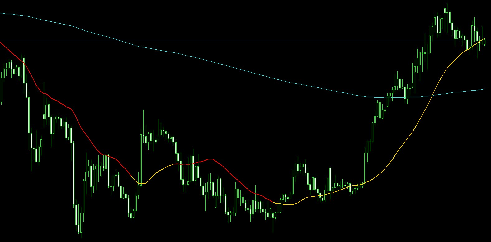

In the Spring of 2019, I was introduced to foreign exchange market trading, Forex, through my parents. The Forex market is a global decentralized market where people are able to trade currency pairs, indices, metals, and stocks. I saw the potential, and learned the fundamentals, but with school, I was unable to dedicate a lot of time to trading. A year passed, and I found myself bored in quarantine, and decided to learn more about indicators and trading bots. After back-testing hundreds of indicators, and watching them in real time, I created an indicator which is a derivative of the Average True Range(ATR) indicator, with some calculation modifications. The light blue line is a smoothed moving average from the standard indicator list provided in MetaTrader4, the platform which hosts the Forex market. This worked well for the metals market, but was unreliable for currency pairs and indices. I utilized this indicator, along with standard market analysis, to enter and exit trades, and overall, I had a 48% success rate. This may not sound amazing, and there are definitely better out there, but the win-loss ratio I used allowed margin for profits. However, I found it was too time consuming to consistently watch the market, waiting for an entry, and then periodically watching the trade for an exit with minimal risk of losses.

MetaTrader4 is coded in the programing language, MQL4, and this language is used to build any software used in MetaTrader4. After finding some success with my remixed indicator, I wanted to see if I could create a trading bot, which would automate trades, using this indicator. This is a frowned upon tactic, as the largest single-day market crash conducted by a private investor, was done through automated trading1. However, automated trading is something that is immensely difficult to do successfully, and the Big-Banks rely on automated trades for market regulation, which is why it remains a legal practice. I was successful in creating a trading bot which worked well sometimes, and failed miserably other times.

The success rate of this bot was around 32%, and a would have blown out my account if I were doing this in the live market. A lot of problems were based around translating my own intuitions and aggregate analysis of the market into code. Also, the indicator would send out false signals due to moving averages calculating in real-time, resulting in the line to be repainted, sometimes multiple times in a short span of time. There was a long process of debugging, and recoding the bot, to adjust for these problems. The entries of the bot were often headed in a good direction, but market reversals would result in the trade exiting as a loss. I then started testing this as an entry bot, where I would then exit the trades based on my own analysis, and the success rate was right around 45%. While the percentage is worse than utilizing the indicator without the auto-trader, I would enter almost 3 times as many trades compared to inputting trades manually. Timing in trading is everything, and if the bot were able to enter me into a trade when I was unable to view the market, I would only have to focus on exiting the trade. Proper risk management is crucial to become a skilled trader as anyone can make a profiting trade as a one-off, but minimizing losses is how one maintains net profits.

Since creating these, I have tested other customized indicators, but ultimately, I want to wait until my knowledge of programing and statistics-based algorithms improve. While I have the source code, I decided not to include them here as I do not want to fall into legal troubles. Simply stating, ”this is not financial advice,” is not enough these days, and I do not wish for anyone to bankrupt themselves with tools I created.

1 A video on the "flash crash" of 2010 can be seen <a href="https://www.youtube.com/watch?v=_ZDEWVJan0s&ab_channel=BloombergQuicktake" target="_blank" rel="noopener noreferrer">here</a>.
