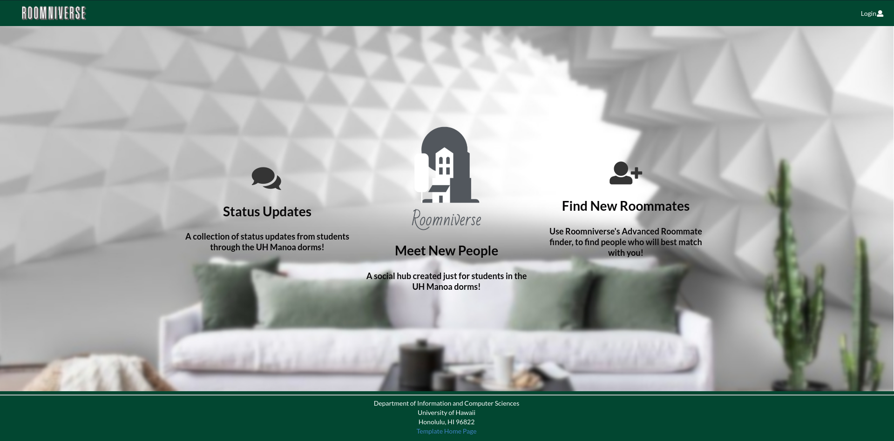

In ICS 314, the final project was to create and develop and functioning webapplication which utilizes MongoDB collections. This assignment was exciting for me as this was the programming project that was developed as a group. We used our knowledge gained over the course in GitHub to create an organization and develop software as a team. This new experience brought many challenges, but the group I was in had a diverse background to programming, so where one person struggled, others excelled and vice versa. My group's organization page can be found at https://roomniverse.github.io/ and our deployed project can be viewed at https://roomniverse.xyz.

## My Contributions

The components I created in the project were the Main Hub, Search feature on the navigation bar, and a way to add, edit, and manage posts in a collection stored in MongoDB. 
