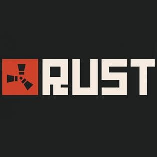

 During the Fall of 2018, I had started playing an online video game called Rust, developed by FacePunch Studios. Rust is a survival, multiplayer, first person shooter, and is an immersive experience where there is no end goal, as with other games in the survival category. You start the game by spawning onto the island, naked, with only a rock and torch. The player ventures off the sandy beaches, and begins the journey of Rust. The player progresses by hitting trees and resource nodes, and collecting items from various monuments and loot crates. On the island, there are many threats such as animals, non-player characters (NPCs), and other players. The lore behind the Rust world is rather extensive, and has been thoroughly investigated numerous times. [This video](https://www.youtube.com/watch?v=363HZguI4CE&ab_channel=SHADOWFRAX), by the Rust YouTuber SHADOWFRAX, is a very in-depth analysis based on content in the game for those curious. As you gather resources, you can craft items, in the same concept of Minecraft, but there are different tiers of equipment you can create.

The game of Rust is highly intricate, with many strategic styles of gameplay, and being a Rust server admin is also quite difficult and complex. Rust is an open-sandbox, server-based game, where every monthly update, every server is forced to wipe their maps and functionally resets the experience for all players. These servers fall under three categories, Official, Community, and Modded. Official servers are hosted by FacePunch and other large server hosts, community servers and modded servers are hosted by private servers which require monthly financing, and drastically range in power and protection. Official and community servers have a gather rate of 1x, and modded incorporates privately created modifications to enhance the gaming experience in some aspect.

I started playing Rust through streaming, and rather quickly picked up the mechanics. I caught the attention of a modded server admin, and was asked to help moderate their main server. I agreed, as I thought it would be fun to learn how rust servers work, and what is required to create a successful server. The server admin had three servers, and was considered medium to low pop, which is actually quite successful in terms of server hosting. Average active player count for their main server was 30-50, and the other two servers were low pop, with about 10 players online at any given time. In the beginning, I helped pick out mods from databases, and soon found myself making modifications to the mods to compliment the other established server mods. The game is coded in C++, however I mainly focused on loot tables and drop rates. Every crate, barrel, and NPC had loot tables, all with independent drop rates, and all could affect player development and gaming style. After creating what I felt to be the most balanced loot tables for the 5x server, I was then asked to become an admin for a new vanilla server (vanilla meaning 1x gather rate).

The server had a few mods, enough to fall under the modded section, and I soon learned the difficulties video game modders face. Every month, FacePunch would update the game, and every server would undergo a forced map wipe. A server owner can also set their own map wipes based on the number of weeks the server has been active, but every server is subject to the update wipe. Official and community servers have few to no mods, and are able to be active immediately after the update, however modded servers had to wait for the mods to be updated by the developers. Furthermore, mods could have bugs which are overlooked since the developers are rushed to update, and this can lead to further delays. Fresh wipe day is the busiest for Rust servers, and if the server is not available, the server’s player-base may choose a different server and be consumed with the game, rather than wait for their main server. These were only a few of the difficulties in being a server admin. The game itself can drain away hours at a time, and it is not uncommon for people to be online upwards of 12+ hours a day. When I was the server admin, I found myself debugging code, and trying to find ways to update the mod without having to wait for the developers to push their update. This worked sometimes, but I would be at the computer for far longer than 12 hours a day right around the forced wipe. 

Overall, the experience was taxing, but I enjoyed the work I did. This also helped me reveal my passion for computer science, and I changed my major from Business to Information and Computer Science, when I was working on the loot tables. I was able to see myself working through code for hours on end, and almost derive enjoyment out of doing so. The game of Rust also helped me to learn true perseverance, to overcome any problem, and accomplish any task I set for myself. Rust is a cut-throat video game, and anyone who plays or has played it, all agree it is not just a video game, but a way of life.
